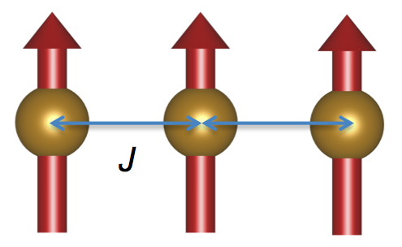

example files are [here](FMChain)

For our first example, let's calculate the the spin wave dispersion 
and S(Q,E) for a one-dimensional ferromagnetic chain. 



This first script calculates the dispersion relation along 100.
```cpp
#include <cmath>
#include <string>
#include "SpinWaveGenie/SpinWaveGenie.h"

using namespace std;
using namespace SpinWaveGenie;

int main(int argc, const char* argv[])
{
    // Cell object stores the basis vectors and Sublattice objects
    Cell cell;
    // set a,b,c,alpha,beta,gamma in units of Angstroms, Degrees
    cell.setBasisVectors(1.0,10.0,10.0,90.0,90.0,90.0);

    Sublattice spin0;
    // each Sublattice contains:
    //   a unique name,
    string name0 = "Spin0";
    spin0.setName(name0);
    //   type (used to calculate the magnetic form factor)
    spin0.setType("NONE");
    //  magnetic moment (magnitude,theta (radians), phi (radians))
    spin0.setMoment(1.0,0.0,0.0);
    //  add sublattice to Cell cell.
    cell.addSublattice(spin0);
    // add atom to sublattice name1 at position (0,0.5,0) in reduced lattice units.
    cell.addAtom(name0,0.0,0.0,0.0);

    // add Cell cell to the builder
    SpinWaveBuilder builder(cell);
    
    // defining interactions.
    InteractionFactory interactions;
    
    // Get exchange interaction named "J" with value "1.0" between sublattices name0 and name0.
    // limit atoms to those between 0.9 and 1.1 angstroms.
    // pass this interaction to the builder.
    builder.addInteraction(interactions.getExchange("J",1.0,name0,name0,0.9,1.1));

    // Returns a SpinWave object containing the cell, sublattices and interactions.
    SpinWave test = builder.createElement();
    
    // Generate 61 points between (0,0,0) and (3,0,0) (units: r.l.u.)
    PointsAlongLine Line;
    Line.setFirstPoint(0.0,0.0,0.0);
    Line.setFinalPoint(3.0,0.0,0.0);
    Line.setNumberPoints(61);
    ThreeVectors<double> kPoints = Line.getPoints();
    
    // Helper function to calculate and save the calculated frequencies and intensities in "FMChain.txt"
    SpinWaveDispersion dispersion;
    dispersion.setFilename("FMChain.txt");
    dispersion.setGenie(test);
    dispersion.setPoints(kPoints);
    // The calculation occurs within the member function SpinWaveDispersion::save().
    dispersion.save();
    return 0;
}
```
Please examine "FMChain.txt". Each line is of the form. 
  H, K, L, (energies), (intensities)

TwoDimensionalCut.cpp
```cpp
    // everything above this point is the same as Dispersion.cpp
    SpinWave SW = builder.createElement();
    
    // More points generates a less pixelated images.
    PointsAlongLine Line;
    Line.setFirstPoint(0.0,0.0,0.0);
    Line.setFinalPoint(3.0,0.0,0.0);
    Line.setNumberPoints(401);
    ThreeVectors<double> kPoints = Line.getPoints();
    
    // Specify energy values for the calculation.
    // min (meV), max (meV), number of points
    Energies energies(0.0, 5.0, 401);
    
    // Define a Gaussian in energy
    OneDimensionalFactory factory;
    // FWHM (meV), tolerance (meV)
    auto gauss = factory.getGaussian(0.25,1.0e-5);
    
    // Convolute results with Gaussian function described earlier.
    unique_ptr<SpinWavePlot> res(memory::make_unique<EnergyResolutionFunction>(move(gauss), SW,energies));
    
    // Helper function to calculate and save the calculated frequencies and intensities in "FMCut.x","FMCut.y" and "FMChut.mat"
    TwoDimensionalCut twodimcut;
    twodimcut.setFilename("FMcut");
    twodimcut.setPlotObject(move(res));
    twodimcut.setPoints(kPoints);
    twodimcut.save();
    return 0;
}
```
The python script below plots the dispersion relation on top
of the cut in S(Q,E).

```python
import matplotlib
matplotlib.use('Agg')
import numpy as np
from matplotlib import rc
import matplotlib.pyplot as plt

rc('font',**{'family':'serif','serif':['Times'],'size':16.0})
rc('text', usetex=True)
fig = matplotlib.pyplot.gcf()
fig.set_size_inches(4.0*2,3.0*2)
ax = plt.subplot(1,1,1)

dispersion = np.transpose(np.loadtxt('FMChain.txt'))
image_array = np.loadtxt('FMcut.mat')
E_array = np.loadtxt('FMcut.y')
x_axis = np.loadtxt('FMcut.x')

im = ax.pcolorfast(x_axis[:,0],E_array,image_array,vmin=0.0,vmax=1.0)
ax.scatter(dispersion[0],dispersion[3],c='white')
ax.set_ylabel(r'Energy (meV)')
ax.set_xlabel(r'distance $(\xi,0,0)$')
ax.set_xlim(left=0.0,right=3.0)
ax.set_ylim(bottom=0.0,top=5.0)
fig.colorbar(im);
plt.savefig('FMChain.png',dpi=400,bbox_inches='tight')
plt.close()
```
View the file 'FMChain.png` It should look like the image below.


PowderAverage.cpp
```cpp


    SpinWave SW = builder.createElement();
    
    PointsAlongLine Line;
    Line.setFirstPoint(0.0,0.0,0.0);
    Line.setFinalPoint(0.0,0.0,3.0*2.0*M_PI);
    Line.setNumberPoints(401);
    ThreeVectors<double> kPoints = Line.getPoints();
    
    Energies energies(0.0, 5.0, 401);
    
    OneDimensionalFactory factory;
    auto gauss = factory.getGaussian(0.25,1.0e-2);
    
    unique_ptr<SpinWavePlot> res(new EnergyResolutionFunction(move(gauss), SW,energies));
    unique_ptr<SpinWavePlot> cut(new IntegrateThetaPhi(move(res),2.0e-2));

    TwoDimensionalCut twodimcut;
    twodimcut.setFilename("FMPowderAverage");
    twodimcut.setPlotObject(move(cut));
    twodimcut.setPoints(kPoints);
    twodimcut.save();
    return 0;
}
```
FMavg.py
```python
import matplotlib
matplotlib.use('Agg')
import numpy as np
from matplotlib import rc
import matplotlib.pyplot as plt

rc('font',**{'family':'serif','serif':['Times'],'size':16.0})
rc('text', usetex=True)
fig = matplotlib.pyplot.gcf()
fig.set_size_inches(4.0*2,3.0*2)
ax = plt.subplot(1,1,1)

dispersion = np.loadtxt('FMChain.txt')
x_axis = np.loadtxt('FMPowderAverage.x')
E_array = np.loadtxt('FMPowderAverage.y')
image_array = np.loadtxt('FMPowderAverage.mat')

print len(image_array)
print len(image_array[0])
print np.max(image_array)
im = ax.pcolorfast(x_axis[:,2]/(2.0*np.pi),E_array,image_array,vmin=0.0,vmax=0.3)
ax.scatter(dispersion[:,0],dispersion[:,3],c='white')
ax.set_ylabel(r'Energy (meV)')
ax.set_xlabel(r'distance $(\xi,0,0)$')
ax.set_xlim(left=0.0,right=3.0)
ax.set_ylim(bottom=0.0,top=5.0)
fig.colorbar(im);
plt.savefig('FMavg.png',dpi=400,bbox_inches='tight')
plt.close()
```


From this directory, you can build the examples below with the following commands.

```
$ cd FMChain
$ mkdir build
$ cmake ..
$ make
```
This should create executables `FMDispersion`, `FMcut`, and `FMPowderAverage` 
