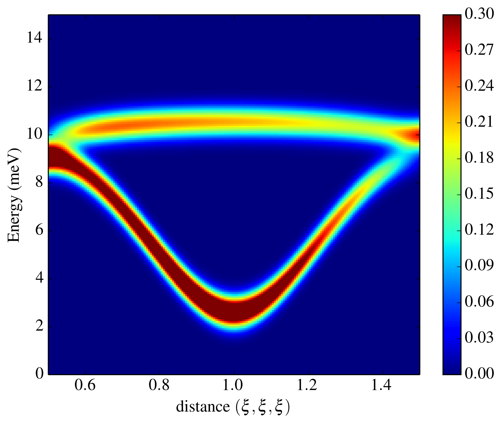
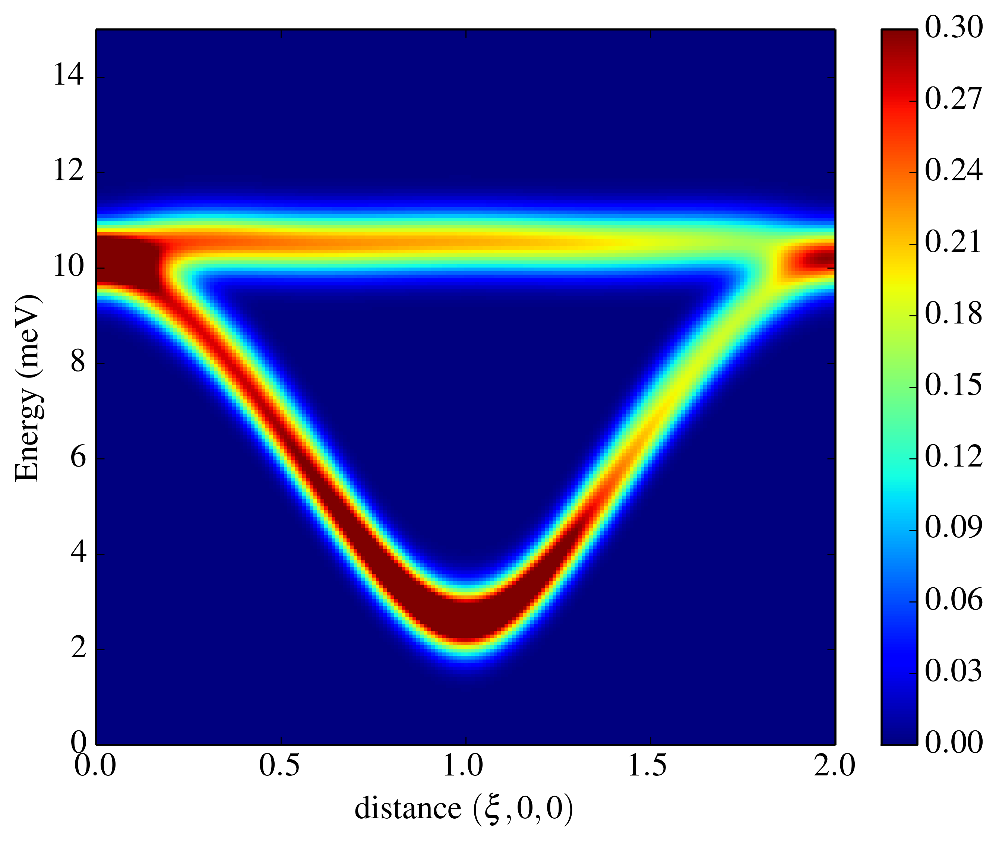
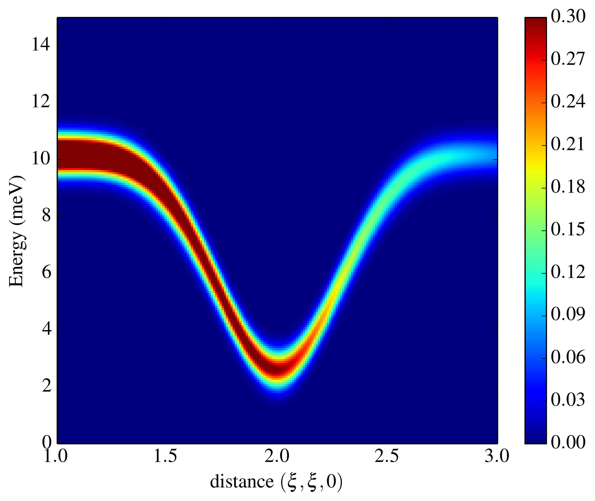

Example files are available [here](MnCoV2O4)

This example studies Co-doped MnV2O4, calculating cuts of S(Q,E), convoluting the calculated frequencies and intensities with an instrument resolution function.

This work is published in [Phys. Rev. B 91 020407](https://journals.aps.org/prb/abstract/10.1103/PhysRevB.91.020407). Please open this paper in a new window/tab. Figure numbers mentioned below refer to this paper.

This example is broken into multipes functions, one that defines the cell and magnetic interactions and others calculating the dispersion in certain directions.

CommonFunctions.cpp

Mn_{1-x}Co_xV_2O_4: 

```cpp
#include <cmath>
#include <iostream>
#include "SpinWaveGenie/SpinWaveGenie.h"

using namespace SpinWaveGenie;

SpinWave getSW()
{
    double SA = 2.1;
    double SB = 0.7;
    double theta = M_PI - 36.0*M_PI/180.0;

    double JAB = -1.8;
    double JBB = -16.0;
    double JBBP = 9.1;
    double DA = 0.4;
    double DB = -9.1;

    Cell cell;
    cell.setBasisVectors(8.5,8.5,8.5,90.0,90.0,90.0);
    
    Sublattice Mn0;
    std::string name = "Mn0";
    Mn0.setName(name);
    Mn0.setType("MN2");
    Mn0.setMoment(SA,0.0,0.0);
    cell.addSublattice(Mn0);
    cell.addAtom(name,0.0,0.0,0.0);
    cell.addAtom(name,0.0,0.5,0.5);
    cell.addAtom(name,0.5,0.0,0.5);
    cell.addAtom(name,0.5,0.5,0.0);
    
    Sublattice Mn1;
    name = "Mn1";
    Mn1.setName(name);
    Mn1.setType("MN2");
    Mn1.setMoment(SA,0.0,0.0);
    cell.addSublattice(Mn1);
    cell.addAtom(name,0.75,0.25,0.75);
    cell.addAtom(name,0.75,0.75,0.25);
    cell.addAtom(name,0.25,0.25,0.25);
    cell.addAtom(name,0.25,0.75,0.75);
    
    Sublattice V0;
    name = "V0";
    V0.setName(name);
    V0.setType("V3");
    V0.setMoment(SB,theta,3.0*M_PI/4.0);
    cell.addSublattice(V0);
    cell.addAtom(name,0.875,0.125,0.375);
    cell.addAtom(name,0.875,0.625,0.875);
    cell.addAtom(name,0.375,0.125,0.875);
    cell.addAtom(name,0.375,0.625,0.375);
    
    Sublattice V1;
    name = "V1";
    V1.setName(name);
    V1.setType("V3");
    V1.setMoment(SB,theta,7.0*M_PI/4.0);
    cell.addSublattice(V1);
    cell.addAtom(name,0.125,0.375,0.875);
    cell.addAtom(name,0.125,0.875,0.375);
    cell.addAtom(name,0.625,0.375,0.375);
    cell.addAtom(name,0.625,0.875,0.875);
    
    Sublattice V2;
    name = "V2";
    V2.setName(name);
    V2.setType("V3");
    V2.setMoment(SB,theta,M_PI/4.0);
    cell.addSublattice(V2);
    cell.addAtom(name,0.375,0.875,0.125);
    cell.addAtom(name,0.375,0.375,0.625);
    cell.addAtom(name,0.875,0.875,0.625);
    cell.addAtom(name,0.875,0.375,0.125);
    
    Sublattice V3;
    name = "V3";
    V3.setName(name);
    V3.setType("V3");
    V3.setMoment(SB,theta,5.0*M_PI/4.0);
    cell.addSublattice(V3);
    cell.addAtom(name,0.625,0.625,0.625);
    cell.addAtom(name,0.625,0.125,0.125);
    cell.addAtom(name,0.125,0.625,0.125);
    cell.addAtom(name,0.125,0.125,0.625);
    
    SpinWaveBuilder builder(cell);

    builder.addInteraction(memory::make_unique<ExchangeInteraction>("Jab",JAB,"Mn0","V0",3.48,3.57));
    builder.addInteraction(memory::make_unique<ExchangeInteraction>("Jab",JAB,"Mn0","V1",3.48,3.57));
    builder.addInteraction(memory::make_unique<ExchangeInteraction>("Jab",JAB,"Mn0","V2",3.48,3.57));
    builder.addInteraction(memory::make_unique<ExchangeInteraction>("Jab",JAB,"Mn0","V3",3.48,3.57));
    builder.addInteraction(memory::make_unique<ExchangeInteraction>("Jab",JAB,"Mn1","V0",3.48,3.57));
    builder.addInteraction(memory::make_unique<ExchangeInteraction>("Jab",JAB,"Mn1","V1",3.48,3.57));
    builder.addInteraction(memory::make_unique<ExchangeInteraction>("Jab",JAB,"Mn1","V2",3.48,3.57));
    builder.addInteraction(memory::make_unique<ExchangeInteraction>("Jab",JAB,"Mn1","V3",3.48,3.57));

    builder.addInteraction(memory::make_unique<ExchangeInteraction>("Jbb",JBB,"V0","V1",2.975,3.06));
    builder.addInteraction(memory::make_unique<ExchangeInteraction>("Jbb",JBB,"V2","V3",2.975,3.06));
    builder.addInteraction(memory::make_unique<ExchangeInteraction>("Jbbp",JBBP,"V0","V2",2.975,3.06));
    builder.addInteraction(memory::make_unique<ExchangeInteraction>("Jbbp",JBBP,"V0","V3",2.975,3.06));
    builder.addInteraction(memory::make_unique<ExchangeInteraction>("Jbbp",JBBP,"V1","V2",2.975,3.06));
    builder.addInteraction(memory::make_unique<ExchangeInteraction>("Jbbp",JBBP,"V1","V3",2.975,3.06));
    
    Vector3 zhat(0.0,0.0,1.0);
    builder.addInteraction(memory::make_unique<AnisotropyInteraction>("Daz",DA,zhat,"Mn0"));
    builder.addInteraction(memory::make_unique<AnisotropyInteraction>("Daz",DA,zhat,"Mn1"));
    
    Vector3 direction(-1.0,1.0,-1.0);
    builder.addInteraction(memory::make_unique<AnisotropyInteraction>("Dby",DB,direction,"V0"));
    direction = Vector3(1.0,-1.0,-1.0);
    builder.addInteraction(memory::make_unique<AnisotropyInteraction>("Dbx",DB,direction,"V1"));
    direction = Vector3(1.0,1.0,-1.0);
    builder.addInteraction(memory::make_unique<AnisotropyInteraction>("Dby",DB,direction,"V2"));
    direction = Vector3(-1.0,-1.0,-1.0);
    builder.addInteraction(memory::make_unique<AnisotropyInteraction>("Dbx",DB,direction,"V3"));
    
    return builder.createElement();
}
```

```cpp
void along111()
{
    SpinWave SW = getSW();
    
    Energies energies(0.0, 15.0, 201);
    
    OneDimensionalFactory factory;
    auto gauss = factory.getGaussian(1.0,1.0e-5);
    
    std::unique_ptr<SpinWavePlot> res(memory::make_unique<EnergyResolutionFunction>(move(gauss), SW, energies));
    
    TwoDimensionalCut twodimcut;
    twodimcut.setFilename("111cut1");
    twodimcut.setPlotObject(move(res));
    PointsAlongLine Line;
    Line.setFirstPoint(0.5,0.5,0.5);
    Line.setFinalPoint(1.5,1.5,1.5);
    Line.setNumberPoints(201);
    twodimcut.setPoints(Line.getPoints());
    twodimcut.save();
    
    twodimcut.setFilename("111cut2");
    Line.setFirstPoint(0.5,0.5,0.5);
    Line.setFinalPoint(1.5,1.5,1.5);
    twodimcut.setPoints(Line.getPoints());
    twodimcut.save();
    
    twodimcut.setFilename("111cut3");
    Line.setFirstPoint(0.5,0.5,0.5);
    Line.setFinalPoint(1.5,1.5,1.5);
    twodimcut.setPoints(Line.getPoints());
    twodimcut.save();
}
```

```cpp
void along001()
{
    SpinWave SW = getSW();
    
    Energies energies(0.0, 15.0, 201);
    
    OneDimensionalFactory factory;
    auto gauss = factory.getGaussian(1.0,1.0e-5);
    
    std::unique_ptr<SpinWavePlot> res(memory::make_unique<EnergyResolutionFunction>(move(gauss), SW, energies));
    
    TwoDimensionalCut twodimcut;
    twodimcut.setFilename("001cut1");
    twodimcut.setPlotObject(move(res));
    PointsAlongLine Line;
    Line.setFirstPoint(1.0,1.0,0.0);
    Line.setFinalPoint(1.0,1.0,2.0);
    Line.setNumberPoints(201);
    twodimcut.setPoints(Line.getPoints());
    twodimcut.save();
    
    twodimcut.setFilename("001cut2");
    Line.setFirstPoint(0.0,1.0,1.0);
    Line.setFinalPoint(2.0,1.0,1.0);
    twodimcut.setPoints(Line.getPoints());
    twodimcut.save();
    
    twodimcut.setFilename("001cut3");
    Line.setFirstPoint(1.0,0.0,1.0);
    Line.setFinalPoint(1.0,2.0,1.0);
    twodimcut.setPoints(Line.getPoints());
    twodimcut.save();
}
```


```cpp

void along110()
{
    SpinWave SW = getSW();
    
    Energies energies(0.0, 15.0, 201);
    
    OneDimensionalFactory factory;
    auto gauss = factory.getGaussian(1.0,1.0e-5);
    
    std::unique_ptr<SpinWavePlot> res(memory::make_unique<EnergyResolutionFunction>(std::move(gauss), SW, energies));
    
    TwoDimensionalCut twodimcut;
    twodimcut.setFilename("110cut1");
    twodimcut.setPlotObject(move(res));
    PointsAlongLine Line;
    Line.setFirstPoint(1.0,1.0,0.0);
    Line.setFinalPoint(3.0,3.0,0.0);
    Line.setNumberPoints(201);
    twodimcut.setPoints(Line.getPoints());
    twodimcut.save();
    
    twodimcut.setFilename("110cut2");
    Line.setFirstPoint(0.0,1.0,1.0);
    Line.setFinalPoint(0.0,3.0,3.0);
    twodimcut.setPoints(Line.getPoints());
    twodimcut.save();
    
    twodimcut.setFilename("110cut3");
    Line.setFirstPoint(1.0,0.0,1.0);
    Line.setFinalPoint(3.0,0.0,3.0);
    twodimcut.setPoints(Line.getPoints());
    twodimcut.save();
}
```

