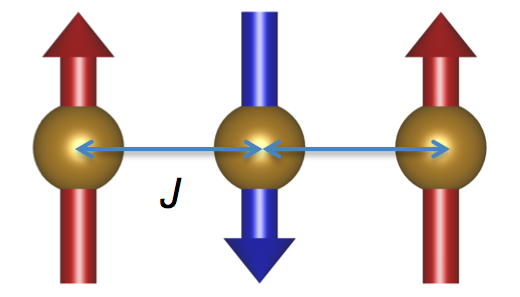

solutions to this exercise are [here](AFMChain)

1. Modify [Example01](../FMChain/FerromagneticChain.md) for the 1D antiferromagnetic chain shown below.

note: You must change the value of `J`. In the solution, I use the value `J = -1.0 meV.`


Calculate the energies and intensities and a cut along 100.

2. Add an easy-plane anisotropy along 100. In the soltion, I use the value `D = 0.1 meV.`

note: For the sublattice "Spin0", this can be accomplished by the following code:
```cpp
Vector3 xhat(1.0,0.0,0.0);
builder.addInteraction(interactions.getAnisotropy("D",0.1,xhat,"Spin0"));
```

3. (extra) Try calculating the spherical average. Why does this fail at certain points?
